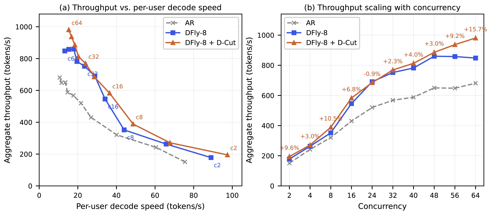

简体中文 | [English](README.md)

<p align="center">
  <picture>
    <source media="(prefers-color-scheme: dark)" srcset="./docs/source/assets/logos/angelslim_logo_light.png">
    
  </picture>
</p>

<h3 align="center">
致力于打造更易用、更全面和更高效的大模型压缩工具包
</h3>

<p align="center">
          ✒️ <a href="https://arxiv.org/abs/2602.21233">TechnicalReport</a>&nbsp&nbsp | &nbsp&nbsp 📖 <a href="https://angelslim.readthedocs.io/">Documentation</a>&nbsp&nbsp | &nbsp&nbsp🤗 <a href="https://huggingface.co/AngelSlim">Hugging Face</a>&nbsp&nbsp | &nbsp&nbsp🤖 <a href="https://modelscope.cn/organization/AngelSlim">ModelScope</a>
<br>
</p>

<p align="center">
          💬 <a href="./docs/source/assets/angel_slim_wechat.png">WeChat</a> | &nbsp&nbsp🫨 <a href="https://discord.com/invite/dHVNeuNdFt">Discord</a>
<br>
</p>

## 📣最新进展
- [26/07/29] 我们已发布 hy4 preview [MIX-STQ1_0 版本](https://huggingface.co/AngelSlim/Hy4-preview-GGUF)！模型从 1.5TB 压缩至 214 GiB，在 SWE-bench Pro 上的性能仅下降了 0.7%。借助 [Prima.cpp]，我们 在4090笔记本（32GB 内存，16GB 显存） 以及搭载 4 张 A4000（32GB 内存，每张 16GB 显存）的服务器 上成功运行了该模型，推理速度达到了 1.02 tokens/s。详情请见[博客](https://opencpil.github.io/prima.cpp/blog/hunyuan4-770b-local-devices)和[部署指南](docs/source/_extra/hy4_preview_gguf_guideline.md)！🔥🔥🔥
- [26/07/20] 我们支持了基于 Megatron-Core 的 Qwen3-MoE 和 Hy3 **量化感知蒸馏**，训练时仅更新量化 scale，并支持 TP/EP/CP/SP 分布式训练。[[文档]](docs/source/features/qad/mcore_qad.md)
- [26/07/06] 我们支持了 **Hy3**（MoE A21B）模型的 FP8-Static 量化，SmoothQuant 量化. [[文档]](https://github.com/Tencent/AngelSlim/tree/main/scripts/ptq)
- [26/06/04] 我们发布了 **Stem**，一种稀疏注意力算法，通过在 block 粒度动态选择 top-k 关键块执行 block-sparse attention，加速长上下文 LLM 的 **Prefill** 阶段，在大幅降低延迟的同时实现几乎无损的生成质量。[[文档]](https://angelslim.readthedocs.io/zh-cn/latest/features/sparse_attention/stem.html)
- [26/06/01] 我们发布了 **DFlare**，一种基于 layer-wise fusion 的块扩散投机解码框架，端到端加速比可达 **5.52×**。[[文档]](https://angelslim.readthedocs.io/zh-cn/latest/features/speculative_decoding/dflare.html)
- [26/05/27] 我们发布了 **D-Cut**，一种用于投机解码的自适应验证深度裁剪技术。[[文档]](https://angelslim.readthedocs.io/zh-cn/latest/dcut.html)
- [26/05/20]  我们支持了模型蒸馏功能，适用于huggingface 全精度或者**QAT量化**模型，详细步骤可以参考[文档](https://angelslim.readthedocs.io/zh-cn/latest/features/distill/index.html).🔥🔥🔥
- [26/05/08] 我们发布了用于 1.25-bit 模型的 STQ1_0 内核，并向 llama.cpp 提交了 [PR #22836](https://github.com/ggml-org/llama.cpp/pull/22836)！如果您对 STQ_0 有任何疑问或建议，欢迎在该 PR 下留言！🔥🔥🔥
- [26/04/29] 我们发布了 2bit 与 1.25bit 腾讯混元翻译模型 [Hy-MT1.5-1.8B-2bit](https://huggingface.co/AngelSlim/Hy-MT1.5-1.8B-2bit), [Hy-MT1.5-1.8B-1.25bit](https://huggingface.co/AngelSlim/Hy-MT1.5-1.8B-1.25bit)。并且还制作了 [离线翻译体验 Demo](https://huggingface.co/AngelSlim/Hy-MT1.5-1.8B-1.25bit/blob/main/Hy-MT-demo.apk)。 欢迎体验 🔥🔥🔥
- [26/04/23] 我们支持了 **Hy3-preview**（MoE A20B）模型的 FP8-Static 量化。
- [26/03/25] 我们发布了量化算法DAQ，该方法在后训练参数更新较小时，可保留量化后模型能力 [[论文]](https://arxiv.org/abs/2603.22324) | [[文档]](docs/source/features/quantization/daq.md)
- [26/02/09] 我们发布了 HY-1.8B-2Bit, 2比特端侧大模型, 模型可见[[Huggingface]](https://huggingface.co/AngelSlim/HY-1.8B-2Bit).
- [26/01/13] 我们发布V0.3版本， 支持了全模态场景的投机采样训练及部署，文档：[Eagle3 for LLM/VLM/Audio](https://angelslim.readthedocs.io/zh-cn/latest/features/speculative_decoding/eagle/index.html)。并且我们发布了 **Sherry** 新的硬件高效的1.25bit三值量化算法 [[论文]](https://arxiv.org/abs/2601.07892) | [[代码]](https://github.com/Tencent/AngelSlim/tree/sherry/Sherry)🔥🔥🔥

<details>
<summary>历史更新</summary>

- [25/11/05] 我们发布V0.2版本，支持了包括GLM-4.6/Qwen3-VL/Qwen3-Omni等更多模型的量化，开源投机采样Eagle3训练框架，更新Diffusion模型量化工具。
- [25/09/30] 我们开源了思考早退新算法 **SpecExit** [[论文]](http://arxiv.org/abs/2509.24248) | [[文档]](https://angelslim.readthedocs.io/zh-cn/latest/features/speculative_decoding/spec_exit.html) | [[vLLM代码]](https://github.com/vllm-project/vllm/pull/27192)
- [25/09/30] 我们发布了三值量化新算法 **Tequila** [[论文]](https://arxiv.org/abs/2509.23809) | [[代码]](https://github.com/Tencent/AngelSlim/tree/tequila/TernaryQuant)
- [25/09/24] 我们支持了Qwen3系列模型的NVFP4的PTQ量化，我们还开源了[Qwen3-32B-NVFP4](https://huggingface.co/AngelSlim/Qwen3-32B_nvfp4)、[Qwen3-235B-A22B-NVFP4](https://huggingface.co/AngelSlim/Qwen3-235B-A22B_nvfp4)权重。
- [25/09/01] 我们支持了[Hunyuan-MT-7B](https://huggingface.co/tencent/Hunyuan-MT-7B-fp8)翻译开源模型的FP8量化；支持了Eagle3的Torch推理及Benchmark评测流程。
- [25/08/06] 我们支持了`Hunyuan 0.5B/1.8B/4B/7B`和`Qwen2.5VL 3B/7B/32B/72B`的FP8、INT4量化，支持了`DeepSeek-R1/V3`和`Kimi-K2`模型的`W4A8-FP8`量化。我们还开源了`Hunyuan 1.8B/4B/7B`系列模型的Eagle3权重。
- [25/07/04] 我们支持了`Hunyuan/Qwen2.5/Qwen3/DeepSeek-R1-Distill-Qwen`等模型的量化，包含INT8、FP8、INT4等算法。
我们还开源了`Qwen3`系列模型的Eagle3权重。

</details>

## 🌟主要特性

- **高度集成化**：本工具将主流的压缩算法集成到工具，开发者可一键式调用，具有很好的易用性。
- **持续算法创新**：本工具除了集成工业界使用最广的算法，还持续自研更好的压缩算法，并且会陆续开源。
- **追求极致性能**：在模型压缩流程、压缩算法部署方面，本工具持续端到端优化，例如单卡GPU可量化Qwen3-235B和Deepseek-R1。

## 💼技术概览

<table>
  <thead>
    <tr>
      <th rowspan="2" style="text-align: center; vertical-align: middle;">场景</th>
      <th rowspan="2" style="text-align: center; vertical-align: middle;">模型</th>
      <th colspan="3" style="text-align: center; vertical-align: middle;">压缩策略</th>
    </tr>
    <tr>
      <th style="text-align: center; vertical-align: middle;">量化</th>
      <th style="text-align: center; vertical-align: middle;">投机采样</th>
      <th style="text-align: center; vertical-align: middle;">其他技术</th>
    </tr>
  </thead>
  <tbody>
    <tr>
      <td><strong>文生文(LLM)</strong></td>
      <td>
        <ul style="padding-left: 0; list-style-position: inside;">
          <li><a href="https://huggingface.co/collections/tencent/hunyuan-dense-model">Hunyuan-Dense</a></li>
          <li><a href="https://huggingface.co/collections/tencent/hunyuan-a13b">Hunyuan-MoE</a></li>
          <li><a href="https://huggingface.co/collections/AngelSlim/qwen3-quant-68652e26da31740739d154f8">Qwen3</a></a></li>
          <li><a href="https://huggingface.co/AngelSlim/DeepSeek-R1-0528_w4a8_fp8">DeepSeek-V3/R1</a></li>
          <li><a href="https://huggingface.co/AngelSlim/Glm4_6-fp8_static">GLM-4.6</a></li>
          <li><a href="https://huggingface.co/collections/AngelSlim/qwen2-25-quant-68652d6cbdf5c0d4b1c4499a">Qwen2.5</a></li>
        </ul>
      </td>
      <td>
        <ul style="padding-left: 0; list-style-position: inside;">
          <li><a href="https://github.com/Tencent/AngelSlim/tree/main/configs/qwen3">FP8-Static/Dynamic</a></li>
          <li><a href="https://github.com/Tencent/AngelSlim/tree/main/configs/qwen3">INT8-Dynamic</a></li>
          <li><a href="https://github.com/Tencent/AngelSlim/tree/main/configs/qwen3">INT4-GPTQ/AWQ/GPTAQ</a></li>
          <li><a href="https://github.com/Tencent/AngelSlim/tree/d55b06aeffc53e31f485044c5026e754f4e27b74/configs/qwen3/nvfp4">NVFP4</a></li>
          <li><a href="https://angelslim.readthedocs.io/zh-cn/latest/features/quantization/fp8_lepto.html">LeptoQuant</a></li>
          <li><a href="https://github.com/Tencent/AngelSlim/tree/tequila/TernaryQuant">Tequila</a> | <a href="https://github.com/Tencent/AngelSlim/tree/sherry/Sherry">Sherry</a></li>
        </ul>
      </td>
      <td>
        <ul style="padding-left: 0; list-style-position: inside;">
          <li><a href="https://app.readthedocs.org/">DFly</a></li>
          <li><a href="https://app.readthedocs.org/">DFlare</a></li>
          <li><a href="https://app.readthedocs.org/">DFlash</a></li>
          <li><a href="https://app.readthedocs.org/">DSpark</a></li>
          <li><a href="https://app.readthedocs.org/">MTP</a></li>
          <li><a href="https://angelslim.readthedocs.io/zh-cn/latest/features/speculative_decoding/eagle/index.html">Eagle3</a></li>
          <li><a href="https://angelslim.readthedocs.io/zh-cn/latest/features/speculative_decoding/spec_exit.html">SpecExit</a></li>
        </ul>
      </td>
      <td>
        <ul style="padding-left: 0; list-style-position: inside;">
          <li>
            <strong>稀疏注意力</strong>
            <ul style="padding-left: 1.5rem">
              <li><a href="https://angelslim.readthedocs.io/zh-cn/latest/features/sparse_attention/stem.html">Stem</a></li>
              <li><a href="https://angelslim.readthedocs.io/zh-cn/latest/features/sparse_attention/index.html">MInference</a>（A-Shape / Tri-Shape / MInference）</li>
              <li><a href="https://angelslim.readthedocs.io/zh-cn/latest/features/sparse_attention/index.html">FlexPrefill</a></li>
              <li><a href="https://angelslim.readthedocs.io/zh-cn/latest/features/sparse_attention/index.html">XAttention</a></li>
              <li><a href="https://angelslim.readthedocs.io/zh-cn/latest/features/sparse_attention/index.html">FlashPrefill</a></li>
              <li><a href="https://angelslim.readthedocs.io/zh-cn/latest/features/sparse_attention/index.html">VecAttention</a></li>
              <li><a href="https://arxiv.org/pdf/2607.25291">CoSA</a></li>
            </ul>
          </li>
          <li>
            <strong>蒸馏</strong>
            <ul style="padding-left: 1.5rem">
              <li><a href="https://angelslim.readthedocs.io/zh-cn/latest/features/distill/index.html">量化蒸馏</a></li>
            </ul>
          </li>
        </ul>
      </td>
    </tr>
    <tr>
      <td><strong>图/视频生文(VLM)</strong></td>
      <td>
        <ul style="padding-left: 0; list-style-position: inside;">
          <li><a href="">Hunyuan-VL</a></li>
          <li><a href="https://huggingface.co/tencent/HunyuanOCR">HunyuanOCR</a></li>
          <li><a href="https://huggingface.co/collections/Qwen/qwen3-vl">Qwen3-VL</a></li>
          <li><a href="https://huggingface.co/collections/Qwen/qwen25-vl">Qwen2.5-VL</a></li>
        </ul>
      </td>
      <td>
        <ul style="padding-left: 0; list-style-position: inside;">
          <li><a href="https://github.com/Tencent/AngelSlim/tree/main/configs/qwen3_vl">FP8-Static/Dynamic</a></li>
          <li><a href="https://github.com/Tencent/AngelSlim/tree/main/configs/qwen2_5_vl">INT8-Dynamic</a></li>
          <li><a href="https://github.com/Tencent/AngelSlim/tree/main/configs/qwen2_5_vl">INT4-GPTQ/AWQ/GPTAQ</a></li>
        </ul>
      </td>
      <td>
        <ul style="padding-left: 0; list-style-position: inside;">
          <li><a href="https://angelslim.readthedocs.io/zh-cn/latest/features/speculative_decoding/eagle/index.html">Eagle3</a></li>
        </ul>
      </td>
      <td>
        <ul style="padding-left: 0; list-style-position: inside;">
          <li>
            <strong>稀疏注意力</strong>
            <ul style="padding-left: 1.5rem">
              <li><a href="https://github.com/anminliu/VecAttention">VecAttention</a></li>
            </ul>
          </li>
          <li>
            <strong>Token剪枝</strong>
            <ul style="padding-left: 1.5rem">
              <li><a href="https://angelslim.readthedocs.io/zh-cn/latest/features/token_compressor/index.html">IDPruner</a></li>
            </ul>
          </li>
        </ul>
      </td>
    </tr>
    <tr>
      <td><strong>文生图/视频/3D(Diffusion)</strong></td>
      <td>
        <ul style="padding-left: 0; list-style-position: inside;">
          <li><a href="https://huggingface.co/collections/tencent/hunyuanimage">Hunyuan-Image</a></li>
          <li><a href="https://huggingface.co/tencent/HunyuanVideo">Hunyuan-Video</a></li>
          <li><a href="https://huggingface.co/collections/tencent/hunyuan3d">Hunyuan-3D</a></li>
          <li><a href="https://huggingface.co/collections/Qwen/qwen-image">Qwen-Image</a></li>
          <li><a href="https://huggingface.co/collections/black-forest-labs/flux1">FLUX</a></li>
          <li><a href="https://huggingface.co/collections/Wan-AI/wan21">Wan</a></li>
          <li><a href="https://huggingface.co/stabilityai/stable-diffusion-xl-base-1.0">SDXL</a></li>
        </ul>
      </td>
      <td>
        <ul style="padding-left: 0; list-style-position: inside;">
          <li><a href="https://angelslim.readthedocs.io/zh-cn/latest/features/diffusion/quantization.html">FP8-Dynamic</a></li>
          <li><a href="https://angelslim.readthedocs.io/zh-cn/latest/features/diffusion/quantization.html">FP8-Weight-Only</a></li>
        </ul>
      </td>
      <td>-</td>
      <td>
        <ul style="padding-left: 0; list-style-position: inside;">
          <li>
            <strong>Cache技术</strong>
            <ul style="padding-left: 1.5rem">
              <li><a href="https://angelslim.readthedocs.io/zh-cn/latest/features/diffusion/cache.html">DeepCache</a></li>
              <li><a href="https://angelslim.readthedocs.io/zh-cn/latest/features/diffusion/cache.html">TeaCache</a></li>
              <li><a href="https://angelslim.readthedocs.io/zh-cn/latest/features/diffusion/cache.html">TaylorCache</a></li>
            </ul>
          </li>
        </ul>
      </td>
    </tr>
    <tr>
      <td><strong>语音(TTS/ASR)</strong></td>
      <td>
        <ul style="padding-left: 0; list-style-position: inside;">
          <li><a href="https://huggingface.co/collections/Qwen/qwen3-omni">Qwen3-Omni</a></li>
          <li><a href="https://huggingface.co/collections/Qwen/qwen2-audio">Qwen2-Audio</a></li>
          <li><a href="https://huggingface.co/FunAudioLLM/Fun-CosyVoice3-0.5B-2512">Fun-CosyVoice3</a></li>
        </ul>
      </td>
      <td>
        <ul style="padding-left: 0; list-style-position: inside;">
          <li><a href="https://github.com/Tencent/AngelSlim/blob/main/docs/source/models/qwen3_omni/qwen3_omni_quant.md">FP8-Static/Dynamic</a></li>
          <li><a href="https://github.com/Tencent/AngelSlim/tree/main/configs/qwen2_audio">INT8-Dynamic</a></li>
        </ul>
      </td>
      <td>
        <ul style="padding-left: 0; list-style-position: inside;">
          <li><a href="https://angelslim.readthedocs.io/zh-cn/latest/features/speculative_decoding/eagle/index.html">Eagle3</a></li>
        </ul>
      </td>
      <td>
        <ul style="padding-left: 0; list-style-position: inside;">
          <li>
            <strong>Token剪枝</strong>
            <ul style="padding-left: 1.5rem">
              <li>建设中</li>
            </ul>
          </li>
        </ul>
      </td>
    </tr>
  </tbody>
</table>


## 🛎️如何使用

### 1、安装 AngelSlim

推荐使用`pip`直接安装最新稳定版`AngelSlim`：

```shell
pip install angelslim
```

也可以选择克隆代码仓库后，以可编辑的方式从源代码安装：

```shell
cd AngelSlim && python setup.py install
```

> **注意：** AngelSlim 以 git submodule 形式集成了投机采样**训练**框架 [AngelSpec](https://github.com/Tencent/AngelSpec)（位于 `third_party/AngelSpec/`）。克隆时请加 `--recursive` 拉取，或在已克隆的仓库中初始化：
>
> ```shell
> # 克隆时同时拉取 submodule
> git clone --recursive https://github.com/Tencent/AngelSlim.git
> # 或者，在已克隆的仓库中执行
> git submodule update --init --recursive
> ```

更详细的安装说明以及不同平台的安装指引，可参考[安装文档](https://angelslim.readthedocs.io/zh-cn/latest/getting_started/installation.html)。

### 2、快速开始

#### 2.1 投机采样

AngelSlim 的投机采样训练由 **[AngelSpec](https://github.com/Tencent/AngelSpec)** 提供（git submodule，位于 `third_party/AngelSpec/`）——一个用于**训练**投机解码 draft 模型的 torch-native 框架，提供丰富的 draft 架构、target 模型支持与生产级训练能力，支持多种 draft 方法，以 **DFly** 与 **MTP + TTT** 为代表。

框架采用**训推分离**设计：推理引擎运行冻结的 target 模型并抽取多层隐状态，经 [Mooncake](https://github.com/kvcache-ai/Mooncake) store 通过 RDMA 直接流式传输（不落盘）至 FSDP2 训练进程，由 controller 负责批处理、背压与评估。推理与训练运行在独立的 GPU 资源池上，可独立扩缩。

**核心能力：**

- **多推理后端** —— vLLM（一等支持）、SGLang、HuggingFace。
- **长序列训练** —— Ulysses 序列并行（USP），支持 128k+ 上下文。
- **文档感知序列 packing** —— 严格的跨文档注意力隔离。
- **在线评估** —— 训练过程中直接测量投机解码接受率。
- **多机** —— 大型 MoE target 模型跨节点分布，经 Mooncake RDMA 互联。
- **词表裁剪** —— 在训练或转换阶段将 draft `lm_head` 裁剪到更小的 token 集。

<!-- TODO: 补充 AngelSpec 框架总览图至 docs/source/assets/speculative_decoding/ 后在此嵌入 -->

```shell
# 初始化 submodule（参见上文安装章节）
git submodule update --init --recursive
cd third_party/AngelSpec
# 安装 AngelSpec 及 vLLM 后端
pip install -e ".[vllm]"
# Hidden-state 传输（extras 未自动拉取，需单独安装）
pip install mooncake-transfer-engine
# 单机快速开始（默认 4 GPU：2 推理 + 2 训练）
./examples/qwen3-8b-single-node/run.sh
```

更多细节请参考[技术报告](https://arxiv.org/abs/2607.25852)、[AngelSpec 文档](https://angelspec.readthedocs.io/)、[AngelSpec README](https://github.com/Tencent/AngelSpec/blob/main/README.md) 与 [Hugging Face 权重](https://huggingface.co/collections/AngelSlim/angelspec)。

#### 2.2 LLM/VLM模型量化
完成安装`AngelSlim`后，您可以通过以下脚本快速开始，完成`Qwen3-1.7B`模型的静态`FP8`量化：

1、一键式启动

  ```shell
  python3 tools/run.py -c configs/qwen3/fp8_static/qwen3-1_7b_fp8_static.yaml
  ```

  该示例将会加载`HugggingFace`模型进行PTQ量化校准，最终量化产出模型权重.

对 **Hy3-preview**（MoE A20B）进行 FP8-Static 量化：

  ```shell
  python tools/run.py -c configs/hunyuan/fp8_static/hunyuanv3_a20b_fp8_static_c8.yaml
  ```

<details>
<summary>2、源码启动</summary>

  例如对`Qwen3-1.7B`完成动态`FP8`量化：

  ```python
  from angelslim.engine import Engine

  slim_engine = Engine()
  # Prepare model
  slim_engine.prepare_model(model_name="Qwen", model_path="Qwen/Qwen3-1.7B")
  # Initialize compressor
  slim_engine.prepare_compressor("PTQ", default_method="fp8_dynamic")
  # Compress model
  slim_engine.run()
  # Save compressed model
  slim_engine.save("./output")
  ```

</details>

详情请参考量化[快速开始文档](https://angelslim.readthedocs.io/zh-cn/latest/getting_started/quickstrat.html)。

#### 2.3 Diffusion模型量化

使用 `scripts/diffusion/run_diffusion.py` 脚本进行量化与推理：

```shell
# 在线量化并运行推理
python scripts/diffusion/run_diffusion.py \
  --model-name-or-path black-forest-labs/FLUX.1-schnell \
  --quant-type fp8-per-tensor \
  --prompt "A cat holding a sign that says hello world" \
  --height 1024 --width 1024 --steps 4 --guidance 0.0 --seed 0
```

更多量化推理方式请参考[Diffusion模型量化文档](https://angelslim.readthedocs.io/zh-cn/latest/features/diffusion/quantization.html)。

#### 2.4 Token 压缩 (多模态/VLM)

AngelSlim 提供了一套基于元数据驱动的通用视觉 Token 剪枝与合并框架。你可以通过以下 Smoke Test 快速验证压缩策略（如 **VisionZip**）：

```shell
python tools/test_universal_pruning.py \
    --model_path "Qwen/Qwen2.5-VL-3B-Instruct" \
    --config "configs/qwen2_5_vl/pruning/visionzip_r0.9.yaml"
```

关于如何新增自定义剪枝策略及算法实现细节，请参考 [Token 压缩说明文档](https://angelslim.readthedocs.io/zh-cn/latest/features/token_compressor/index.html)。

### 3、部署与测试

#### 3.1 离线推理

通过`transformers`加载量化模型进行离线推理。

<details>
<summary>执行脚本细节</summary>

```shell
python scripts/deploy/offline.py $MODEL_PATH "Hello, my name is"
```

其中 `MODEL_PATH` 为量化产出模型路径。

</details>

#### 3.2 服务部署

支持通过 **vLLM**、**SGLang**推理框架部署 OpenAI 兼容的 API 服务。

<details>
<summary>执行脚本细节</summary>

- **vLLM**

  [vLLM](https://github.com/vllm-project/vllm) 服务启动脚本，建议版本`vllm>=0.8.5.post1`，部署MOE INT8量化模型需要`vllm>=0.9.2`。

  ```shell
  bash scripts/deploy/run_vllm.sh --model-path $MODEL_PATH --port 8080 -d 0,1,2,3 -t 4 -p 1 -g 0.8 --max-model-len 4096
  ```
  其中`-d`为可见设备，`-t`为张量并行度，`-p`为流水线并行度，`-g`为显存使用率。

- **SGLang**

  [SGLang](https://github.com/sgl-project/sglang) 服务启动脚本，建议版本 `sglang>=0.4.6.post1`：

  ```shell
  bash scripts/deploy/run_sglang.sh --model-path $MODEL_PATH --port 8080 -d 0,1,2,3 -t 4 -g 0.8
  ```

</details>

#### 3.3 服务调用

通过 [OpenAI 格式](https://platform.openai.com/docs/api-reference/introduction) 接口发起请求。

<details>
<summary>执行脚本细节</summary>

```shell
bash scripts/deploy/openai.sh -m $MODEL_PATH -p "Hello, my name is" --port 8080 --max-tokens 4096 --temperature 0.7 --top-p 0.8 --top-k 20 --repetition-penalty 1.05 --system-prompt "You are a helpful assistant."
```
其中`-p`为输入prompt

</details>

#### 3.4 效果验证

使用 [lm-evaluation-harness](https://github.com/EleutherAI/lm-evaluation-harness) 评估量化模型精度，建议版本`lm-eval>=0.4.8`

<details>
<summary>执行脚本细节</summary>

```shell
bash scripts/deploy/lm_eval.sh -d 0,1 -t 2 -g 0.8 -r $RESULT_PATH -b "auto" --tasks ceval-valid,mmlu,gsm8k,humaneval -n 0 $MODEL_PATH
```
其中`RESULT_PATH`为测试结果保存目录，`-b`为batch size大小，`--tasks`为评测任务，`-n`为few-shot数量

</details>

详细操作指南请参阅[部署文档](https://angelslim.readthedocs.io/zh-cn/latest/deployment/deploy.html)。

## 📈Benchmark

### 1、投机采样

下列结果来自 **[AngelSpec](https://github.com/Tencent/AngelSpec)**——一个 torch-native、训推分离投机采样训练框架，由 AngelSlim 以 git submodule 形式集成（详见 2.1 节），支持多种 draft 方法，以 **DFly** 与 **MTP + TTT** 为代表。[[论文]](https://arxiv.org/abs/2607.25852) | [[文档]](https://angelspec.readthedocs.io/) | [[Hugging Face]](https://huggingface.co/collections/AngelSlim/angelspec)

**✨ 核心亮点**
- **🏗️ 全链路开源**：AngelSpec 训练框架 + Hy3-A21B 的 MTP / DFly drafter 权重与训练代码，一次性放出。
- **🚀 DFly 全面领先**：在 Hy3-A21B 上，DFly 于 4–64 全部并发档位、六个 benchmark 均取得最高吞吐——相较 AR 基线平均加速 **1.98–2.40×**（代码 / 数学单项峰值 **2.86×**），并比 DFlash 快 **10.5–11.8%**。
- **📈 接受长度大幅提升**：DFly 平均接受长度达 **4.79**，较 DFlash（3.69）**+30%**、较 MTP（3.00）约 **1.6×**，HumanEval 高达 **5.52**。
- **⚡ D-cut 榨干高并发**：在 295B 模型线上真实流量中，高并发区间额外带来最高 **+15.7%** 吞吐，且几乎无损（平均接受长度 2.50 → 2.46）。
- **💬 MTP + TTT 攻克对话**：修复训练-推理不一致，平均接受率 **52.8% → 66.4%**，平均接受长度 **2.58 → 2.99**。

#### 1.1 🏆 Drafter 大比拼：DFly 领跑

**起草质量：平均接受长度。** 在 **Qwen3-8B** 与 **Hy3-A21B** 上、覆盖数学/代码/对话基准测得（temperature = 1，no thinking）；**粗体**表示每个目标模型在对应基准上的最优 drafter。**DFly** 平均领先——Qwen3-8B 达 **5.41**、Hy3-A21B 达 **4.79**，并在几乎所有基准上夺魁，明显甩开 DFlash 与 MTP。

<table>
  <thead>
    <tr>
      <th rowspan="2">Target Model</th>
      <th rowspan="2">Drafter</th>
      <th colspan="2" style="text-align:center;">Math</th>
      <th colspan="3" style="text-align:center;">Code</th>
      <th style="text-align:center;">Chat</th>
      <th rowspan="2">Avg.</th>
    </tr>
    <tr>
      <th>Math500</th><th>GSM8K</th>
      <th>HumanEval</th><th>MBPP</th><th>LiveCodeBench</th>
      <th>MT-Bench</th>
    </tr>
  </thead>
  <tbody>
    <!-- Qwen3-8B -->
    <tr>
      <td rowspan="4">Qwen3-8B</td>
      <td>MTP</td>
      <td>3.53</td><td>3.56</td><td>3.33</td><td>3.22</td><td>3.25</td><td>2.57</td><td>3.24</td>
    </tr>
    <tr>
      <td>DFlash</td>
      <td>4.97</td><td>5.54</td><td>4.77</td><td>4.50</td><td>4.46</td><td>3.16</td><td>4.57</td>
    </tr>
    <tr>
      <td>DSpark</td>
      <td>5.87</td><td>6.25</td><td>5.56</td><td>5.25</td><td>5.20</td><td><b>3.77</b></td><td>5.32</td>
    </tr>
    <tr>
      <td><b>DFly</b></td>
      <td><b>6.06</b></td><td><b>6.42</b></td><td><b>5.60</b></td><td><b>5.34</b></td><td><b>5.36</b></td><td>3.67</td><td><b>5.41</b></td>
    </tr>
    <!-- Hy3-A21B -->
    <tr>
      <td rowspan="3">Hy3-A21B</td>
      <td>MTP</td>
      <td>3.30</td><td>3.30</td><td>3.13</td><td>3.04</td><td>2.84</td><td>2.40</td><td>3.00</td>
    </tr>
    <tr>
      <td>DFlash</td>
      <td>4.01</td><td>4.23</td><td>4.36</td><td>4.05</td><td>3.10</td><td>2.38</td><td>3.69</td>
    </tr>
    <tr>
      <td><b>DFly</b></td>
      <td><b>5.23</b></td><td><b>5.53</b></td><td><b>5.52</b></td><td><b>5.41</b></td><td><b>4.07</b></td><td><b>2.96</b></td><td><b>4.79</b></td>
    </tr>
  </tbody>
</table>

**端到端吞吐：Hy3-295B-A21B。** 相对 AR 基线的输出 token 吞吐（Tok/s）与加速比（Spd.）（TP=8，temperature 1，并发 c4–c64；每格为 3×120s 窗口）。**粗体**表示每个基准在对应并发下的最优加速比；`MTP-3` 使用 3 个投机 token，`DFlash-8` / `DFly-8` 使用 block 长度 8。**DFly-8** 在每个并发档位都拿下最高平均加速——相较 AR **1.98×–2.40×**，HumanEval 上峰值达 **2.86×**。

<table>
  <thead>
    <tr>
      <th rowspan="2">Conc.</th>
      <th rowspan="2">Method</th>
      <th colspan="2" style="text-align:center;">GSM8K</th>
      <th colspan="2" style="text-align:center;">Math500</th>
      <th colspan="2" style="text-align:center;">HumanEval</th>
      <th colspan="2" style="text-align:center;">MBPP</th>
      <th colspan="2" style="text-align:center;">LiveCodeBench</th>
      <th colspan="2" style="text-align:center;">MT-Bench</th>
      <th colspan="2" style="text-align:center;">Avg.</th>
    </tr>
    <tr>
      <th>Tok/s</th><th>Spd.</th>
      <th>Tok/s</th><th>Spd.</th>
      <th>Tok/s</th><th>Spd.</th>
      <th>Tok/s</th><th>Spd.</th>
      <th>Tok/s</th><th>Spd.</th>
      <th>Tok/s</th><th>Spd.</th>
      <th>Tok/s</th><th>Spd.</th>
    </tr>
  </thead>
  <tbody>
    <!-- c4 -->
    <tr>
      <td rowspan="4">c4</td>
      <td>AR</td>
      <td>287.9</td><td>1.00×</td>
      <td>293.9</td><td>1.00×</td>
      <td>279.7</td><td>1.00×</td>
      <td>294.4</td><td>1.00×</td>
      <td>284.5</td><td>1.00×</td>
      <td>290.0</td><td>1.00×</td>
      <td>288.4</td><td>1.00×</td>
    </tr>
    <tr>
      <td>MTP-3</td>
      <td>495.5</td><td>1.72×</td>
      <td>517.0</td><td>1.76×</td>
      <td>473.6</td><td>1.69×</td>
      <td>476.7</td><td>1.62×</td>
      <td>414.0</td><td>1.46×</td>
      <td>384.5</td><td><b>1.33×</b></td>
      <td>460.2</td><td>1.60×</td>
    </tr>
    <tr>
      <td>DFlash-8</td>
      <td>569.5</td><td>1.98×</td>
      <td>587.9</td><td>2.00×</td>
      <td>588.1</td><td>2.10×</td>
      <td>575.7</td><td>1.96×</td>
      <td>408.4</td><td>1.44×</td>
      <td>371.6</td><td>1.28×</td>
      <td>516.9</td><td>1.79×</td>
    </tr>
    <tr>
      <td><b>DFly-8</b></td>
      <td>635.4</td><td><b>2.21×</b></td>
      <td>643.9</td><td><b>2.19×</b></td>
      <td>647.2</td><td><b>2.31×</b></td>
      <td>661.5</td><td><b>2.25×</b></td>
      <td>455.2</td><td><b>1.60×</b></td>
      <td>384.0</td><td>1.32×</td>
      <td>571.2</td><td><b>1.98×</b></td>
    </tr>
    <!-- c8 -->
    <tr>
      <td rowspan="4">c8</td>
      <td>AR</td>
      <td>426.3</td><td>1.00×</td>
      <td>435.7</td><td>1.00×</td>
      <td>400.3</td><td>1.00×</td>
      <td>433.7</td><td>1.00×</td>
      <td>413.4</td><td>1.00×</td>
      <td>421.8</td><td>1.00×</td>
      <td>421.8</td><td>1.00×</td>
    </tr>
    <tr>
      <td>MTP-3</td>
      <td>756.9</td><td>1.78×</td>
      <td>791.5</td><td>1.82×</td>
      <td>717.4</td><td>1.79×</td>
      <td>729.1</td><td>1.68×</td>
      <td>620.8</td><td>1.50×</td>
      <td>590.1</td><td><b>1.40×</b></td>
      <td>701.0</td><td>1.66×</td>
    </tr>
    <tr>
      <td>DFlash-8</td>
      <td>857.0</td><td>2.01×</td>
      <td>860.1</td><td>1.97×</td>
      <td>866.2</td><td>2.16×</td>
      <td>866.2</td><td>2.00×</td>
      <td>609.1</td><td>1.47×</td>
      <td>545.5</td><td>1.29×</td>
      <td>767.4</td><td>1.82×</td>
    </tr>
    <tr>
      <td><b>DFly-8</b></td>
      <td>964.8</td><td><b>2.26×</b></td>
      <td>959.5</td><td><b>2.20×</b></td>
      <td>974.1</td><td><b>2.43×</b></td>
      <td>1001.5</td><td><b>2.31×</b></td>
      <td>641.3</td><td><b>1.55×</b></td>
      <td>565.8</td><td>1.34×</td>
      <td>851.2</td><td><b>2.02×</b></td>
    </tr>
    <!-- c16 -->
    <tr>
      <td rowspan="4">c16</td>
      <td>AR</td>
      <td>650.7</td><td>1.00×</td>
      <td>670.6</td><td>1.00×</td>
      <td>594.8</td><td>1.00×</td>
      <td>667.9</td><td>1.00×</td>
      <td>617.2</td><td>1.00×</td>
      <td>628.1</td><td>1.00×</td>
      <td>638.2</td><td>1.00×</td>
    </tr>
    <tr>
      <td>MTP-3</td>
      <td>1146.6</td><td>1.76×</td>
      <td>1174.0</td><td>1.75×</td>
      <td>1076.1</td><td>1.81×</td>
      <td>1103.3</td><td>1.65×</td>
      <td>893.5</td><td>1.45×</td>
      <td>876.6</td><td>1.40×</td>
      <td>1045.0</td><td>1.64×</td>
    </tr>
    <tr>
      <td>DFlash-8</td>
      <td>1446.1</td><td>2.22×</td>
      <td>1430.4</td><td>2.13×</td>
      <td>1433.3</td><td>2.41×</td>
      <td>1440.4</td><td>2.16×</td>
      <td>970.5</td><td>1.57×</td>
      <td>901.0</td><td>1.43×</td>
      <td>1270.3</td><td>1.99×</td>
    </tr>
    <tr>
      <td><b>DFly-8</b></td>
      <td>1623.8</td><td><b>2.50×</b></td>
      <td>1607.5</td><td><b>2.40×</b></td>
      <td>1595.4</td><td><b>2.68×</b></td>
      <td>1677.8</td><td><b>2.51×</b></td>
      <td>1046.7</td><td><b>1.70×</b></td>
      <td>961.5</td><td><b>1.53×</b></td>
      <td>1418.8</td><td><b>2.22×</b></td>
    </tr>
    <!-- c32 -->
    <tr>
      <td rowspan="4">c32</td>
      <td>AR</td>
      <td>918.6</td><td>1.00×</td>
      <td>1000.8</td><td>1.00×</td>
      <td>850.8</td><td>1.00×</td>
      <td>1018.7</td><td>1.00×</td>
      <td>893.2</td><td>1.00×</td>
      <td>921.1</td><td>1.00×</td>
      <td>933.9</td><td>1.00×</td>
    </tr>
    <tr>
      <td>MTP-3</td>
      <td>1923.8</td><td>2.09×</td>
      <td>1989.8</td><td>1.99×</td>
      <td>1780.7</td><td>2.09×</td>
      <td>1863.6</td><td>1.83×</td>
      <td>1394.2</td><td>1.56×</td>
      <td>1469.4</td><td>1.60×</td>
      <td>1736.9</td><td>1.86×</td>
    </tr>
    <tr>
      <td>DFlash-8</td>
      <td>2261.8</td><td>2.46×</td>
      <td>2334.3</td><td>2.33×</td>
      <td>2170.6</td><td>2.55×</td>
      <td>2339.3</td><td>2.30×</td>
      <td>1489.9</td><td>1.67×</td>
      <td>1453.4</td><td>1.58×</td>
      <td>2008.2</td><td>2.15×</td>
    </tr>
    <tr>
      <td><b>DFly-8</b></td>
      <td>2527.4</td><td><b>2.75×</b></td>
      <td>2608.9</td><td><b>2.61×</b></td>
      <td>2429.1</td><td><b>2.86×</b></td>
      <td>2741.3</td><td><b>2.69×</b></td>
      <td>1602.6</td><td><b>1.79×</b></td>
      <td>1549.4</td><td><b>1.68×</b></td>
      <td>2243.1</td><td><b>2.40×</b></td>
    </tr>
    <!-- c64 -->
    <tr>
      <td rowspan="4">c64</td>
      <td>AR</td>
      <td>1156.9</td><td>1.00×</td>
      <td>1381.3</td><td>1.00×</td>
      <td>1197.6</td><td>1.00×</td>
      <td>1513.9</td><td>1.00×</td>
      <td>1229.6</td><td>1.00×</td>
      <td>1306.9</td><td>1.00×</td>
      <td>1297.7</td><td>1.00×</td>
    </tr>
    <tr>
      <td>MTP-3</td>
      <td>2932.0</td><td><b>2.53×</b></td>
      <td>3170.0</td><td>2.29×</td>
      <td>2639.6</td><td>2.20×</td>
      <td>3011.3</td><td>1.99×</td>
      <td>2050.4</td><td>1.67×</td>
      <td>2350.0</td><td><b>1.80×</b></td>
      <td>2692.2</td><td>2.08×</td>
    </tr>
    <tr>
      <td>DFlash-8</td>
      <td>2523.4</td><td>2.18×</td>
      <td>2947.1</td><td>2.13×</td>
      <td>2655.2</td><td>2.22×</td>
      <td>2671.8</td><td>1.76×</td>
      <td>2015.8</td><td>1.64×</td>
      <td>1815.8</td><td>1.39×</td>
      <td>2438.2</td><td>1.89×</td>
    </tr>
    <tr>
      <td><b>DFly-8</b></td>
      <td>2827.8</td><td>2.44×</td>
      <td>3301.8</td><td><b>2.39×</b></td>
      <td>2965.0</td><td><b>2.48×</b></td>
      <td>3130.9</td><td><b>2.07×</b></td>
      <td>2195.0</td><td><b>1.79×</b></td>
      <td>1936.6</td><td>1.48×</td>
      <td>2726.2</td><td><b>2.11×</b></td>
    </tr>
  </tbody>
</table>

#### 1.2 ⚡ D-cut：突破高并发吞吐天花板

并发一高，target 验证就成了瓶颈，被拒绝的 draft 后缀白白占用 batch 容量。**D-cut** 把验证当作 batch 级的共享预算——按「期望收益/成本」对各请求的验证深度全局排序，空闲时自动加深 draft，繁忙时主动裁剪。优势恰好出现在 DFly 触顶之处：并发 48 之后 DFly 吞吐饱和，而 D-cut 仍在把负载转化为吞吐，相较 DFly 最高 **+15.7%**，且几乎无损（平均接受长度 2.50 → 2.46）。

<p align="center">
  
</p>

### 2、量化

下面只展示了部分模型的效果测试情况，完整Benchmark可以参考[Benchmark文档](https://angelslim.readthedocs.io/zh-cn/latest/performance/quantization/benchmarks.html)

#### 2.1 Hunyuan系列模型

Hunyuan-Instruct的`BF16`、`FP8`、`INT4-GPTQ`、`INT4-AWQ`在`OlympiadBench`、`AIME 2024`、`DROP`、`GPQA-Diamond`上的评测结果如下：

<table>
  <thead>
    <tr><th>Model</th><th>Quantization</th><th>OlympiadBench</th><th>AIME 2024</th><th>DROP</th><th>GPQA-Diamond</th></tr>
  </thead>
  <tbody>
    <tr><td rowspan="4">Hunyuan-A13B-Instruct</td>
    <td>BF16</td><td>82.7</td><td>87.30</td><td>91.1</td><td>71.2</td></tr>
    <tr><td>FP8-Static</td><td>83.0</td><td>86.7</td><td>91.1</td><td>-</td></tr>
    <tr><td>Int4-GPTQ</td><td>82.7</td><td>86.7</td><td>91.1</td><td>-</td></tr>
    <tr><td>Int4-AWQ</td><td>82.6</td><td>85.6</td><td>91.0</td><td>-</td></tr>
  </tbody>
  <tbody>
    <tr><td rowspan="4">Hunyuan-7B-Instruct</td>
    <td>BF16</td>          <td>76.5</td><td>81.1</td><td>85.9</td><td>60.1</td></tr>
    <tr><td>FP8-Static</td><td>76.6</td><td>80.9</td><td>86.0</td><td>60.1</td></tr>
    <tr><td>Int4-GPTQ</td><td>76.2</td><td>81.0</td><td>85.7</td><td>60.0</td></tr>
    <tr><td>Int4-AWQ</td><td>76.4</td><td>80.9</td><td>85.9</td><td>60.1</td></tr>
  </tbody>
  <tbody>
    <tr><td rowspan="4">Hunyuan-4B-Instruct</td>
    <td>BF16</td>          <td>73.1</td><td>78.3</td><td>78.2</td><td>61.1</td></tr>
    <tr><td>FP8-Static</td><td>73.1</td><td>76.6</td><td>78.3</td><td>60.2</td></tr>
    <tr><td>Int4-GPTQ</td><td>72.9</td><td>-</td><td>78.1</td><td>58.1</td></tr>
    <tr><td>Int4-AWQ</td><td>72.8</td><td>-</td><td>78.2</td><td>-</td></tr>
  </tbody>
  <tbody>
    <tr><td rowspan="4">Hunyuan-1.8B-Instruct</td>
    <td>BF16</td>          <td>63.4</td><td>56.7</td><td>76.7</td><td>47.2</td></tr>
    <tr><td>FP8-Static</td><td>62.5</td><td>55.2</td><td>75.1</td><td>47.7</td></tr>
    <tr><td>Int4-GPTQ</td><td>60.9</td><td>-</td><td>73.0</td><td>44.4</td></tr>
    <tr><td>Int4-AWQ</td><td>61.7</td><td>-</td><td>71.7</td><td>43.6</td></tr>
  </tbody>
  <tbody>
    <tr><td rowspan="4">Hunyuan-0.5B-Instruct</td>
    <td>BF16</td>          <td>29.6</td><td>17.2</td><td>52.8</td><td>23.3</td></tr>
    <tr><td>FP8-Static</td><td>29.6</td><td>17.2</td><td>51.6</td><td>22.5</td></tr>
    <tr><td>Int4-GPTQ</td><td>26.8</td><td>-</td><td>50.9</td><td>23.3</td></tr>
    <tr><td>Int4-AWQ</td><td>26.3</td><td>-</td><td>48.9</td><td>23.3</td></tr>
  </tbody>
</table>


#### 2.2 Qwen3系列模型

Qwen3系列模型的`BF16`、`FP8-Static`、`FP8-Dynamic`、`INT8-Dynamic`、`INT4-GPTQ`、`INT4-AWQ`在`CEVAL`、`MMLU`、`GSM8K`、`HUMANEVAL`上的评测结果如下：


<table>
  <thead>
    <tr><th>Model</th><th>Quantization</th><th>CEVAL</th><th>MMLU</th><th>GSM8K</th><th>HUMANEVAL</th></tr>
  </thead>
  <tbody>
    <tr><td rowspan="4">Qwen3-0.6B</td><td>BF16</td><td>45.84</td><td>47.21</td><td>42.99</td><td>19.51</td></tr>
    <tr><td>FP8-Static</td><td>45.99</td><td>46.87</td><td>38.06</td><td>18.90</td></tr>
    <tr><td>FP8-Dynamic</td><td>45.99</td><td>46.93</td><td>38.29</td><td>20.73</td></tr>
    <tr><td>INT8-Dynamic</td><td>45.17</td><td>46.95</td><td>41.17</td><td>21.34</td></tr>
    <tr><td rowspan="6">Qwen3-8B</td><td>BF16</td><td>79.27</td><td>74.78</td><td>87.79</td><td>63.41</td></tr>
    <tr><td>FP8-Static</td><td>78.23</td><td>74.79</td><td>86.96</td><td>62.20</td></tr>
    <tr><td>FP8-Dynamic</td><td>78.45</td><td>74.75</td><td>87.64</td><td>62.80</td></tr>
    <tr><td>INT8-Dynamic</td><td>78.01</td><td>74.84</td><td>86.96</td><td>67.07</td></tr>
    <tr><td>INT4-GPTQ</td><td>77.19</td><td>73.26</td><td>86.43</td><td>62.20</td></tr>
    <tr><td>INT4-AWQ</td><td>76.15</td><td>73.59</td><td>86.96</td><td>63.41</td></tr>
    <tr><td rowspan="6">Qwen3-14B</td><td>BF16</td><td>83.06</td><td>78.90</td><td>88.40</td><td>55.49</td></tr>
    <tr><td>FP8-Static</td><td>82.62</td><td>78.57</td><td>89.46</td><td>57.32</td></tr>
    <tr><td>FP8-Dynamic</td><td>82.24</td><td>78.92</td><td>88.32</td><td>52.44</td></tr>
    <tr><td>INT8-Dynamic</td><td>81.87</td><td>78.13</td><td>86.28</td><td>56.10</td></tr>
    <tr><td>INT4-GPTQ</td><td>81.05</td><td>78.02</td><td>87.34</td><td>57.93</td></tr>
    <tr><td>INT4-AWQ</td><td>82.02</td><td>77.68</td><td>84.23</td><td>61.59</td></tr>
    <tr><td rowspan="5">Qwen3-32B</td><td>BF16</td><td>86.55</td><td>82.00</td><td>74.53</td><td>37.80</td></tr>
    <tr><td>FP8-Static</td><td>86.92</td><td>81.78</td><td>70.20</td><td>39.63</td></tr>
    <tr><td>FP8-Dynamic</td><td>86.55</td><td>81.89</td><td>70.43</td><td>38.41</td></tr>
    <tr><td>INT4-GPTQ</td><td>86.18</td><td>81.01</td><td>-</td><td>43.29</td></tr>
    <tr><td>INT4-AWQ</td><td>86.18</td><td>81.54</td><td>-</td><td>36.59</td></tr>
    <tr><td rowspan="4">Qwen3-30B-A3B</td><td>BF16</td><td>83.66</td><td>79.36</td><td>89.99</td><td>31.71</td></tr>
    <tr><td>FP8-Static</td><td>83.95</td><td>79.47</td><td>89.01</td><td>31.10</td></tr>
    <tr><td>FP8-Dynamic</td><td>84.10</td><td>79.40</td><td>89.16</td><td>32.93</td></tr>
    <tr><td>INT8-Dynamic</td><td>83.36</td><td>79.48</td><td>89.16</td><td>34.15</td></tr>
    <tr><td rowspan="4">Qwen3-235B-A22B</td><td>BF16</td><td>89.60</td><td>86.28</td><td>85.29</td><td>27.44</td></tr>
    <tr><td>FP8-Static</td><td>89.67</td><td>86.19</td><td>86.96</td><td>27.44</td></tr>
    <tr><td>FP8-Dynamic</td><td>89.67</td><td>86.18</td><td>85.22</td><td>28.05</td></tr>
    <tr><td>INT8-Dynamic</td><td>88.93</td><td>86.20</td><td>86.20</td><td>23.78</td></tr>
  </tbody>
</table>

#### 2.3 DeepSeek系列模型

DeepSeek-R1-0528模型的`FP8-Block-Wise`、`W4A8-FP8`在`GPQA Diamond`、`AIME 2024`、`SimpleQA`、`LiveCodeBench`上的评测结果如下：

<table>
  <thead>
    <tr><th>Model</th><th>Quantization</th><th>GPQA Diamond</th><th>AIME 2024</th><th>SimpleQA</th><th>LiveCodeBench</th></tr>
  </thead>
  <tbody>
    <tr><td rowspan="6">DeepSeek-R1-0528</td><td>FP8-Block-Wise</td><td>78.28</td><td>88.67</td><td>27.8</td><td>77.1</td></tr>
    <tr><td>W4A8-FP8</td><td>77.37</td><td>88.67</td><td>26.83</td><td>78.86</td></tr>
  </tbody>
</table>

<details>
<summary>备注</summary>

> - 以上评测结果使用TRT-LLM框架部署测试5次求平均
> - 评测时使用的超参如下:
> ```json
>{
>  "top_k": 20,
>  "top_p": 0.6,
>  "temperature": 0.7,
>  "output_seq_len": 32768,
>  "max_input_seq_len": 16384
>}
>```

</details>

#### 2.4 Qwen-VL 系列模型

**Qwen3-VL Benchmark**

Qwen3VL系列模型的`BF16`、`FP8-Static`、`FP8-Dynamic`在`MMMU_VAL`、`DocVQA_VAL`、`ChartQA_TEST`上的评测结果如下：

<table>
  <thead>
    <tr><th>Model</th><th>Quantization</th><th>MMMU_VAL</th><th>DocVQA_VAL</th><th>ChartQA_TEST</th></tr>
  </thead>
  <tbody>
    <tr><td rowspan="3">Qwen3-VL-32B-Instruct</td><td>BF16</td><td>60.11</td><td>96.08</td><td>94.64</td></tr>
    <tr><td>FP8-Static</td><td>61.22</td><td>96.00</td><td>94.64</td></tr>
    <tr><td>FP8-Dynamic</td><td>60.78</td><td>96.19</td><td>94.72</td></tr>
    <tr><td rowspan="2">Qwen3-VL-30B-A3B-Instruct</td><td>BF16</td><td>50.44</td><td>95.28</td><td>95.36</td></tr>
    <tr><td>FP8-Dynamic</td><td>50.67</td><td>95.25</td><td>95.20</td></tr>
  </tbody>
</table>

<details>
<summary><strong>Qwen2.5VL Benchmark</strong></summary>

Qwen2.5VL系列模型的`BF16`、`FP8-Static`、`FP8-Dynamic`、`INT4-GPTQ`、`INT4-AWQ`在`MMMU_VAL`、`DocVQA_VAL`、`ChartQA_TEST`上的评测结果如下：

<table>
  <thead>
    <tr><th>Model</th><th>Quantization</th><th>MMMU_VAL</th><th>MMLDocVQA_VALU</th><th>ChartQA_TEST</th></tr>
  </thead>
  <tbody>
    <tr><td rowspan="5">Qwen2.5VL-3B</td><td>BF16</td><td>47.11</td><td>78.57</td><td>80.32</td></tr>
    <tr><td>FP8-Static</td><td>47.33</td><td>79.34</td><td>79.68</td></tr>
    <tr><td>FP8-Dynamic</td><td>45.99</td><td>46.93</td><td>38.29</td></tr>
    <tr><td>INT4-GPTQ</td><td>46.56</td><td>77.20</td><td>78.96</td></tr>
    <tr><td>INT4-AWQ</td><td>45.78</td><td>-</td><td>79.60</td></tr>
   <tr><td rowspan="5">Qwen2.5VL-7B</td><td>BF16</td><td>45.44</td><td>89.71</td><td>84.64</td></tr>
    <tr><td>FP8-Static</td><td>47.00</td><td>89.83</td><td>85.92</td></tr>
    <tr><td>FP8-Dynamic</td><td>47.22</td><td>89.80</td><td>88.64</td></tr>
    <tr><td>INT4-GPTQ</td><td>46.67</td><td>90.45</td><td>-</td></tr>
    <tr><td>INT4-AWQ</td><td>45.67</td><td>89.28</td><td>-</td></tr>
    <tr><td rowspan="5">Qwen2.5VL-32B</td><td>BF16</td><td>57.00</td><td>90.03</td><td>-</td></tr>
    <tr><td>FP8-Static</td><td>57.00</td><td>89.88</td><td>-</td></tr>
    <tr><td>FP8-Dynamic</td><td>56.44</td><td>89.88</td><td>-</td></tr>
    <tr><td>INT4-GPTQ</td><td>55.22</td><td>89.80 </td><td>-</td></tr>
    <tr><td>INT4-AWQ</td><td>55.22</td><td>90.30</td><td>-</td></tr>
    <tr><td rowspan="5">Qwen2.5VL-72B</td><td>BF16</td><td>58.78</td><td>94.39</td><td>85.60</td></tr>
    <tr><td>FP8-Static</td><td>57.89</td><td>94.41</td><td>85.84</td></tr>
    <tr><td>FP8-Dynamic</td><td>58.67</td><td>94.38</td><td>85.60</td></tr>
    <tr><td>INT4-GPTQ</td><td>57.56</td><td>94.46</td><td>86.48</td></tr>
    <tr><td>INT4-AWQ</td><td>58.78</td><td>94.19</td><td>87.28</td></tr>
  </tbody>
</table>

</details>

#### 2.5 Qwen-Omni 系列模型

**Qwen3-Omni Text to Text Benchmark**

Qwen3-Omni系列模型的`BF16`、`FP8-Static`、`FP8-Dynamic`在`aime25`、`gpqa_diamond`、`mmlu_redux`上的评测结果如下：

<table>
  <thead>
    <tr><th>Model</th><th>Quantization</th><th>aime25</th><th>gpqa_diamond</th><th>mmlu_redux</th></tr>
  </thead>
  <tbody>
    <tr><td rowspan="3">Qwen3-Omni-30B-A3B-Instruct</td><td>BF16</td><td>73.32</td><td>56.77</td><td>88.09</td></tr>
    <tr><td>FP8-Static</td><td>71.33</td><td>56.57</td><td>87.91</td></tr>
    <tr><td>FP8-Dynamic</td><td>73.33</td><td>55.15</td><td>88.07</td></tr>
  </tbody>
</table>

<details>
<summary>备注</summary>

> - 以上评测结果使用vllm框架部署测试5次求平均(vllm只支持thinker部分)
> - 评测时使用的超参如下:
> ```json
>{
>  "top_p": 0.95,
>  "temperature": 0.6,
>  "do_sample": true,
>  "max-model-len 65536": 65536
>}
>```

</details>

#### 2.6 其他模型

其他模型比如GLM、Qwen2.5、Seed-OSS等模型利用`FP8-Static`、`FP8-Dynamic`、`INT4-GPTQ`、`INT4-AWQ`量化等策略在`CEVAL`、`MMLU`、`GSM8K`上进行了评测。

<details>
<summary>Benchmark实验细节</summary>

<table>
  <thead>
    <tr><th>Model</th><th>Quantization</th><th>CEVAL</th><th>MMLU</th><th>GSM8K</th></tr>
  </thead>
  <tbody>
    <tr><td rowspan="3">Qwen2.5-1.5B-Instruct</td><td>BF16</td><td>67.01</td><td>60.05</td><td>54.28</td></tr>
    <tr><td>FP8-Static</td><td>66.27</td><td>60.23</td><td>-</td></tr>
    <tr><td>FP8-Dynamic</td><td>66.79</td><td>60.08</td><td>51.71</td></tr>
    <tr><td rowspan="5">Qwen2.5-7B-Instruct</td><td>BF16</td><td>81.20</td><td>74.55</td><td>79.98</td></tr>
    <tr><td>FP8-Static</td><td>81.13</td><td>74.03</td><td>79.30</td></tr>
    <tr><td>FP8-Dynamic</td><td>80.31</td><td>74.07</td><td>79.00</td></tr>
    <tr><td>INT4-GPTQ</td><td>79.05</td><td>73.05</td><td>74.75</td></tr>
    <tr><td>INT4-AWQ</td><td>79.35</td><td>73.22</td><td>79.38</td></tr>
    <tr><td rowspan="5">Qwen2.5-32B-Instruct</td><td>BF16</td><td>87.30</td><td>83.21</td><td>81.73</td></tr>
    <tr><td>FP8-Static</td><td>87.59</td><td>83.08</td><td>81.58</td></tr>
    <tr><td>FP8-Dynamic</td><td>87.30</td><td>83.04</td><td>81.58</td></tr>
    <tr><td>INT4-GPTQ</td><td>86.70</td><td>82.45</td><td>82.03</td></tr>
    <tr><td>INT4-AWQ</td><td>87.00</td><td>82.64</td><td>-</td></tr>
    <tr><td rowspan="5">DeepSeek-R1-Distill-Qwen-7B</td><td>BF16</td><td>53.49</td><td>53.80</td><td>75.74</td></tr>
    <tr><td>FP8-Static</td><td>53.57</td><td>54.17</td><td>76.19</td></tr>
    <tr><td>FP8-Dynamic</td><td>52.97</td><td>54.13</td><td>74.15</td></tr>
    <tr><td>INT4-GPTQ</td><td>51.86</td><td>52.44</td><td>75.89</td></tr>
    <tr><td>INT4-AWQ</td><td>53.49</td><td>53.70</td><td>-</td></tr>
    <tr><td rowspan="5">DeepSeek-R1-Distill-Qwen-14B</td><td>BF16</td><td>77.71</td><td>74.28</td><td>85.67</td></tr>
    <tr><td>FP8-Static</td><td>77.56</td><td>74.66</td><td>86.73</td></tr>
    <tr><td>FP8-Dynamic</td><td>76.82</td><td>74.63</td><td>87.11</td></tr>
    <tr><td>INT4-GPTQ</td><td>74.29</td><td>72.37</td><td>84.61</td></tr>
    <tr><td>INT4-AWQ</td><td>74.81</td><td>73.00</td><td>86.05</td></tr>
    <tr><td rowspan="5">DeepSeek-R1-Distill-Qwen-32B</td><td>BF16</td><td>84.18</td><td>80.89</td><td>87.41</td></tr>
    <tr><td>FP8-Static</td><td>83.43</td><td>80.90</td><td>87.57</td></tr>
    <tr><td>FP8-Dynamic</td><td>83.73</td><td>81.10</td><td>86.43</td></tr>
    <tr><td>INT4-GPTQ</td><td>84.10</td><td>79.80</td><td>86.73</td></tr>
    <tr><td>INT4-AWQ</td><td>82.84</td><td>80.15</td><td>87.19</td></tr>
  </tbody>
</table>

</details>

### 3. Token 压缩 (多模态/VLM)

我们在 **Qwen2.5-VL-3B-Instruct** 模型上评估了多种视觉 Token 压缩策略（剪枝与合并）。你可以使用以下指令复现评测结果：

```shell
python tools/run_pruning_eval.py \
    --model_path "Qwen/Qwen2.5-VL-3B-Instruct" \
    --configs "configs/qwen2_5_vl/pruning/visionzip_r0.9.yaml" \
    --tasks "textvqa" \
    --output_dir "./results/visionzip_test"
```

<details>
<summary><b>Token 压缩详细评测结果 (Qwen2.5-VL-3B-Instruct)</b></summary>

<table style="text-align:center; vertical-align:middle;">
  <thead>
    <tr>
      <th>方法</th>
      <th>AI2D</th>
      <th>ChartQA</th>
      <th>DocVQA</th>
      <th>MMB<sup>CN</sup></th>
      <th>MMB</th>
      <th>MME</th>
      <th>MMStar</th>
      <th>OCRBench</th>
      <th>POPE</th>
      <th>SQA</th>
      <th>VQA<sup>Text</sup></th>
      <th>平均值</th>
    </tr>
  </thead>
  <tbody>
    <tr>
      <td><b>Baseline</b></td>
      <td>79.11</td>
      <td>83.56</td>
      <td>92.48</td>
      <td>73.28</td>
      <td>77.32</td>
      <td>1517</td>
      <td>56.05</td>
      <td>80.10</td>
      <td>87.41</td>
      <td>80.81</td>
      <td>78.79</td>
      <td>100.0%</td>
    </tr>
    <tr style="background-color: #808080;">
      <th colspan="13">保留 25% Tokens (75% 压缩比)</th>
    </tr>
    <tr><td>FastV</td><td>72.70</td><td>70.04</td><td>75.98</td><td>63.40</td><td>66.92</td><td>1437</td><td>47.39</td><td>36.60</td><td>86.42</td><td>79.33</td><td>73.51</td><td>86.02%</td></tr>
    <tr><td>VisionZip</td><td>74.19</td><td>71.32</td><td>70.11</td><td>67.35</td><td>71.22</td><td>1452</td><td>49.37</td><td>42.50</td><td>85.51</td><td><u>81.36</u></td><td>68.12</td><td>87.34%</td></tr>
    <tr><td>HiPrune</td><td>73.83</td><td>72.76</td><td>72.10</td><td>67.27</td><td>72.34</td><td>1449</td><td>48.93</td><td>41.30</td><td>85.86</td><td>80.91</td><td>69.27</td><td>87.67%</td></tr>
    <tr><td>VisionSelector</td><td>75.19</td><td>73.72</td><td><b>90.24</b></td><td><u>68.81</u></td><td>72.59</td><td><b>1521</b></td><td><u>49.97</u></td><td><u>61.80</u></td><td>85.36</td><td>80.37</td><td><u>76.86</u></td><td><u>93.62%</u></td></tr>
    <tr><td>DivPrune</td><td>73.06</td><td>62.96</td><td>78.46</td><td>67.10</td><td>71.82</td><td>1459</td><td>48.38</td><td>51.40</td><td><b>86.81</b></td><td>80.22</td><td>68.91</td><td>88.15%</td></tr>
    <tr><td>DART</td><td>71.08</td><td>65.20</td><td>79.72</td><td>65.38</td><td>71.05</td><td>1428</td><td>48.78</td><td>41.80</td><td>80.97</td><td>80.91</td><td>68.25</td><td>86.17%</td></tr>
    <tr><td>VisPruner</td><td>74.29</td><td>68.20</td><td>72.52</td><td>67.35</td><td>70.88</td><td>1458</td><td>49.74</td><td>44.80</td><td>86.59</td><td><b>81.46</b></td><td>69.62</td><td>87.87%</td></tr>
    <tr><td>SCOPE</td><td><u>75.84</u></td><td><u>74.00</u></td><td>82.40</td><td><u>68.81</u></td><td><u>72.94</u></td><td>1471</td><td><b>50.35</b></td><td>56.00</td><td><u>86.62</u></td><td>80.96</td><td>74.04</td><td>91.98%</td></tr>
    <tr><td><b>IDPruner</b></td><td><b>75.94</b></td><td><b>75.84</b></td><td><u>90.00</u></td><td><b>69.42</b></td><td><b>73.80</b></td><td><u>1505</u></td><td>49.49</td><td><b>64.90</b></td><td>86.26</td><td>80.42</td><td><b>76.90</b></td><td><b>94.42%</b></td></tr>
    <tr style="background-color: #808080;">
      <th colspan="13">保留 10% Tokens (90% 压缩比)</th>
    </tr>
    <tr><td>FastV</td><td>65.87</td><td>29.72</td><td>36.89</td><td>48.37</td><td>51.98</td><td>1257</td><td>37.28</td><td>13.90</td><td>79.50</td><td>77.05</td><td>57.75</td><td>65.30%</td></tr>
    <tr><td>VisionZip</td><td>67.65</td><td>51.60</td><td>37.88</td><td>59.62</td><td>63.06</td><td>1338</td><td>42.82</td><td>21.40</td><td>81.14</td><td>80.47</td><td>51.56</td><td>72.75%</td></tr>
    <tr><td>HiPrune</td><td>67.75</td><td>53.20</td><td>41.15</td><td>59.45</td><td>63.14</td><td>1326</td><td>41.08</td><td>20.30</td><td>80.90</td><td><b>80.96</b></td><td>53.31</td><td>73.00%</td></tr>
    <tr><td>VisionSelector</td><td><u>70.50</u></td><td><b>65.92</b></td><td><b>79.94</b></td><td>59.97</td><td>64.69</td><td>1374</td><td>42.86</td><td><u>45.20</u></td><td>82.66</td><td><u>80.61</u></td><td><b>71.57</b></td><td>84.42%</td></tr>
    <tr><td>DivPrune</td><td>67.71</td><td>43.12</td><td>58.03</td><td>61.25</td><td>65.12</td><td>1389</td><td>40.43</td><td>27.90</td><td>82.24</td><td>79.18</td><td>56.87</td><td>75.50%</td></tr>
    <tr><td>DART</td><td>67.49</td><td>47.56</td><td>60.23</td><td>57.99</td><td>63.83</td><td>1299</td><td>42.18</td><td>23.40</td><td>74.20</td><td>78.63</td><td>58.02</td><td>74.09%</td></tr>
    <tr><td>VisPruner</td><td>67.75</td><td>47.92</td><td>48.65</td><td>59.28</td><td>63.32</td><td>1305</td><td>41.51</td><td>22.50</td><td>78.74</td><td>79.77</td><td>54.95</td><td>73.19%</td></tr>
    <tr><td>SCOPE</td><td>69.75</td><td>56.24</td><td>55.01</td><td><b>64.26</b></td><td><u>67.18</u></td><td><u>1390</u></td><td><b>44.35</b></td><td>30.80</td><td><u>83.34</u></td><td>80.47</td><td>62.58</td><td>79.37%</td></tr>
    <tr><td><b>IDPruner</b></td><td><b>71.79</b></td><td><u>63.32</u></td><td><u>79.38</u></td><td><u>63.57</u></td><td><b>68.21</b></td><td><b>1438</b></td><td><u>44.05</u></td><td><b>45.50</b></td><td><b>84.51</b></td><td>80.57</td><td><u>70.02</u></td><td><b>85.71%</b></td></tr>
  </tbody>
</table>

</details>

## 📝许可协议

本项目的代码依照 [License for AngelSlim](LICENSE) 协议开源。

## 🔗引用
```
@article{angelslim2026,
  title={AngelSlim: A more accessible, comprehensive, and efficient toolkit for large model compression},
  author={Hunyuan AI Infra Team},
  journal={arXiv preprint arXiv:2602.21233},
  year={2026}
}
```

## 💬技术交流

- AngelSlim是由腾讯混元AI Infra团队研发，新功能在持续迭代更新中，有问题或建议欢迎通过[GitHub Issues](https://github.com/Tencent/AngelSlim/issues)给我们提issue，或者加入[微信技术交流群](./docs/source/assets/angel_slim_wechat.png)。

- ⭐ 欢迎给这个仓库点Star来关注后续我们的更新。并且如果有兴趣加入团队进行实习或正式工作，可投递简历至邮箱：lucayu@tencent.com。
