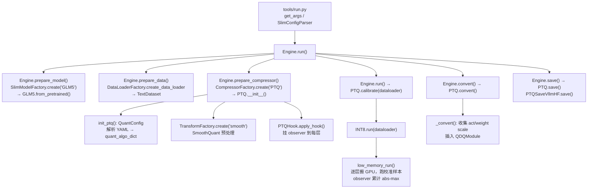

# AngelSlim PTQ 调用文档与工作原理分析 —— 以 ChatGLM 5.2 为例

> 本文档基于仓库当前代码（`angelslim/` + `tools/run.py` + `configs/glm5/` + `scripts/ptq/run_glm5_w8a8c16.sh`）整理，聚焦 **W8A8C16（INT8 权重 + INT8 动态激活 + bf16 KV Cache）** 在 **ChatGLM 5.2（`GlmMoeDsaForCausalLM`，78 层 MoE + MLA + DSA）** 上的 PTQ 流程。

---

## 1. 调用文档（Quick Start）

### 1.1 一键启动脚本

入口脚本：[scripts/ptq/run_glm5_w8a8c16.sh](/apdcephfs_zwfy2/share_300532381/harviexu/project/AngelSlim/scripts/ptq/run_glm5_w8a8c16.sh)

```bash
cd /apdcephfs_zwfy2/share_300532381/harviexu/project/AngelSlim
bash scripts/ptq/run_glm5_w8a8c16.sh
```

脚本关键环境变量与参数：

| 变量 / 参数 | 默认值 | 说明 |
|---|---|---|
| `REPO_ROOT` | 自动推导 | 仓库根目录，并写入 `PYTHONPATH` |
| `CUDA_VISIBLE_DEVICES` | `0,1,2,3,4,5,6,7` | 可见 GPU（单 8 卡节点） |
| `OMP_NUM_THREADS` | `8` | CPU 线程数（逐层流式量化时 CPU 重） |
| `MODEL_PATH` | `/apdcephfs_zwfy2/share_300532381/harviexu/chatglm5.2` | 原始 bf16 权重目录 |
| `SAVE_PATH` | `${REPO_ROOT}/output_glm5_w8a8c16` | 量化产物输出目录 |
| `CONFIG` | `configs/glm5/w8a8_int8/glm5_w8a8c16_low_memory.yaml` | PTQ 配置 |

实际调用：

```bash
python3 tools/run.py \
    -c "${CONFIG}" \
    --model-path "${MODEL_PATH}" \
    --save-path  "${SAVE_PATH}"
```

CLI 参数（[tools/run.py](/apdcephfs_zwfy2/share_300532381/harviexu/project/AngelSlim/tools/run.py) `get_args()`）：

| 参数 | 含义 |
|---|---|
| `-c / --config` | **必填**，YAML 配置文件路径 |
| `--model-path` | 覆盖 YAML 中的 `model.model_path` |
| `--save-path` | 覆盖 YAML 中的 `global.save_path`（并追加 YAML 前缀子目录） |
| `--multi-nodes` | 多节点蒸馏/训练（PTQ 一般不用） |
| `--lm-eval` / `--ppl-eval` | 量化后评测（可选） |

### 1.2 YAML 配置字段说明

配置文件：[configs/glm5/w8a8_int8/glm5_w8a8c16_low_memory.yaml](/apdcephfs_zwfy2/share_300532381/harviexu/project/AngelSlim/configs/glm5/w8a8_int8/glm5_w8a8c16_low_memory.yaml)

| 顶层键 | 字段 | 取值 | 作用 |
|---|---|---|---|
| `global` | `save_path` | `./output_glm5_w8a8c16` | 输出根目录（CLI `--save-path` 会覆盖并加前缀） |
| `model` | `name` | `GLM5` | 选择模型适配器类 `GLM5`（`SlimModelFactory` 注册名） |
| `model` | `model_path` | 权重目录 | 原始权重路径 |
| `model` | `torch_dtype` | `bfloat16` | 以 bf16 加载（与 config.json 原生 dtype 一致） |
| `model` | `device_map` | `cpu` | 模型先全部驻留 CPU；`low_memory` 模式再逐层搬到 GPU |
| `model` | `use_cache` | `false` | 校准阶段关闭 KV cache |
| `compression` | `name` | `PTQ` | 选择压缩器 `PTQ` |
| `compression.quantization` | `name` | `int8_dynamic` | INT8 + 动态激活算法名 |
| `compression.quantization` | `bits` | `8` | 量化位宽 |
| `compression.quantization` | `low_memory` | `true` | **逐层流式量化**（CPU 驻留，单层搬 GPU） |
| `compression.quantization.quant_method` | `weight` | `per-channel` | 权重 INT8 per-channel |
| `compression.quantization.quant_method` | `activation` | 见下方⚠️ | 激活量化策略 |
| `compression.quantization.quant_helpers` | `smooth` | SmoothQuant 预处理 |
| `compression.quantization` | `smooth_alpha` | `0.5` | SmoothQuant 平滑系数 |
| `compression.quantization` | `ignore_layers` | `[lm_head, embed_tokens]` | 追加到**强制跳过的层列表** |
| `dataset` | `name` | `TextDataset` | 校准数据集类型 |
| `dataset` | `data_path` | `./dataset/qa/question_calib.jsonl` | 校准数据（已预处理为 `applied_message` 格式） |
| `dataset` | `max_seq_length` | `2048` | 序列长度 |
| `dataset` | `num_samples` | `64` | 校准样本数 |
| `dataset` | `batch_size` | `1` | 批大小 |

> ⚠️ **重要配置陷阱（踩坑点）**：
> YAML 里**不要写** `activation: "per-token"`。本仓库 `ACT_OBSERVERS_CLASS` 仅有两个合法键：`"per-tensor"` 与 `"per-channel"`（见 [core/config.py](/apdcephfs_zwfy2/share_300532381/harviexu/project/AngelSlim/angelslim/compressor/quant/core/config.py)）。
> 动态 INT8（`int8_dynamic`）的激活 scale 在**推理时在线计算**（`act_observer=None`），代码逻辑为：
> ```python
> is_dynamic = "dynamic" if "dynamic" in self.quant_algo else "static"
> self.act_observer = (
>     ACT_OBSERVERS_CLASS[act_quant_method] if "static" in is_dynamic else None
> )
> ```
> 即 `int8_dynamic` 时 `act_observer=None`，**不需要** activation observer。
> 因此 YAML 应改为：**直接删除 `activation` 字段**（或留空），只保留 `weight: per-channel`。写成 `"per-token"` 会触发 `KeyError: 'per-token'`。

### 1.3 量化产物

输出目录 `output_glm5_w8a8c16/<yaml前缀>/` 包含：

- `model.safetensors` / `*.safetensors`：量化后权重（INT8 权重 + 反量化的 bf16 权重，视 saver 而定）
- `config.json`：注入 `quantization_config`（含 `activation_scheme: dynamic`、`INT8`、`ignored_layers`）
- `hf_quant_config.json`：TensorRT-LLM 风格的量化配置
- `tokenizer*`：分词器
- `angelslim_config.json`：本次运行的环境与配置快照（debug 用）

---

## 2. 工作原理分析

### 2.1 总体数据流



### 2.2 各阶段机理

#### 阶段 0：配置解析（`QuantConfig`）
文件：[core/config.py](/apdcephfs_zwfy2/share_300532381/harviexu/project/AngelSlim/angelslim/compressor/quant/core/config.py)

`QuantConfig.__init__` 把 YAML 字符串映射为**具体的 Observer 类**与 `quant_algo_info` 字典：

- `weight: "per-channel"` → `WEIGHT_OBSERVERS_CLASS["per-channel"]` = `AbsMaxChannelWiseWeightObserver`（权重按输出通道统计 abs-max）
- `int8_dynamic` → `act_observer = None`（动态激活无校准 observer）
- `quant_algo_info = {"w": "int8_per-channel", "ignore_layers": [...]}` —— 供 saver 生成 `quantization_config`

#### 阶段 1：模型加载（`GLM5.from_pretrained`）
文件：[models/llm/glm5.py](/apdcephfs_zwfy2/share_300532381/harviexu/project/AngelSlim/angelslim/models/llm/glm5.py)、[models/base_model.py](/apdcephfs_zwfy2/share_300532381/harviexu/project/AngelSlim/angelslim/models/base_model.py)

- `SlimModelFactory.create("GLM5")` 实例化 `GLM5`（继承 `BaseLLMModel`）。
- `BaseLLMModel.from_pretrained` 调用 `AutoModelForCausalLM.from_pretrained(..., device_map="cpu", torch_dtype=bf16)`，把 **78 层全部权重驻留 CPU**（省 GPU 显存）。
- `modal_type = "LLM"`。

#### 阶段 2：SmoothQuant 预处理（可选）
文件：[modules/smooth/smooth.py](/apdcephfs_zwfy2/share_300532381/harviexu/project/AngelSlim/angelslim/compressor/quant/modules/smooth/smooth.py)、[glm5.py](/apdcephfs_zwfy2/share_300532381/harviexu/project/AngelSlim/angelslim/models/llm/glm5.py)

GLM-5 的 `get_smooth_mapping_layers` 定义了两组平滑映射：

```python
( ["q_a_proj", "kv_a_proj_with_mqa"], "input_layernorm" ),       # MLA 注意力首层
( ["gate_proj", "up_proj"],            "post_attention_layernorm" ),  # MLP / MoE
```

SmoothQuant 公式（[smooth.py](/apdcephfs_zwfy2/share_300532381/harviexu/project/AngelSlim/angelslim/compressor/quant/modules/smooth/smooth.py) `convert()`）：

```
s_j = max(|X_j|)^alpha / max(|W_j|)^(1-alpha)
W' = W * diag(s_j)        # 权重吸收缩放
X' = X * diag(1/s_j)      # 激活反向缩放
```

目的：把激活的离群值（outlier）迁移到权重，使后续 INT8 量化误差更小。

#### 阶段 3：挂 Observer（`PTQHook.apply_hook`）
文件：[core/hook.py](/apdcephfs_zwfy2/share_300532381/harviexu/project/AngelSlim/angelslim/compressor/quant/core/hook.py)

1. `quant_layers_dict = self.quant_model.get_observer_layers()` —— **GLM5 决定哪些层要量化**（见 §3）。
2. 对每个量化层 `register_forward_hook(_forward_hook)`，`_forward_hook` 在每次前向时把 `(input, output)` 喂给该层的 `PTQObserver`。
3. Observer 在 `forward` 中累计 abs-max（激活 per-token / 权重 per-channel）。

> 注意：KV cache observer 对 GLM-5 被**刻意关闭**（YAML 未设 `quant_method.kv_cache`），所以 GLM-5 的 KV cache 保持原生 bf16，不参与量化。

#### 阶段 4：校准（`INT8.run → low_memory_run`）
文件：[modules/int8/int8.py](/apdcephfs_zwfy2/share_300532381/harviexu/project/AngelSlim/angelslim/compressor/quant/modules/int8/int8.py)、[modules/catcher.py](/apdcephfs_zwfy2/share_300532381/harviexu/project/AngelSlim/angelslim/compressor/quant/modules/catcher.py)

`low_memory_run` 是 GLM-5（78 层、单卡放不下）能跑通的关键：

1. **捕获输入**（仅 layer 0）：用 `Catcher` 包裹第 0 层，跑一遍校准数据，把每个样本的 `hidden_states` 与 `kwargs`（`position_ids`/`attention_mask`/`position_embeddings`）按样本存下来，`Catcher.forward` 末尾 `raise ValueError` 终止前向。
2. **逐层流式量化**：
   - 模型主体驻留 CPU；每层 `layers[i].to(dev=cuda:0)` 搬上 GPU；
   - 对每个校准样本 `j`，`outs[j] = layer(hidden_states=inps[j], **layer_kwargs)`；
   - observer 在 hook 中累计该层的激活/权重 abs-max；
   - 该层算出后 `.cpu()` 搬回，再搬下一层（`torch.cuda.empty_cache()` 清显存）。
3. **DSA 跨层状态**：GLM-5 的 `indexer_types` 是 `full`/`shared` 交替（每 4 层 1 个 full + 3 个 shared）。`shared` 层复用上一层 `full` 层的 top-k 索引 `prev_topk_indices`。`low_memory_run` 手写循环，必须**手动维护 `prev_topk_indices` 跨层/跨样本传递**（代码里 `carry_topk` 自动检测 `hasattr(layers[0].self_attn, 'indexer')` 启用）。
4. **device 一致性**：所有 `layer_kwargs` 中的 tensor（含裸 `position_ids`、`attention_mask`）都需在 `low_memory_run` 中 `.to(dev)`，否则 indexer 内部 `cuda:0` 的 `key_positions` 与 CPU 的 `position_ids` 比较会报 device mismatch。

#### 阶段 5：转换（`PTQ._convert`）
文件：[ptq.py](/apdcephfs_zwfy2/share_300532381/harviexu/project/AngelSlim/angelslim/compressor/quant/ptq.py)

1. 遍历 `ptq_hook.quant_layers_dict`，从 observer 取 `scales()`：
   - `act_scales_dict[name] = observer.act_observer.scales()`（动态模式此项为空）
   - `weight_scales_dict[name] = quant_model.get_weight_scales(...)`
2. `ptq_hook.remove_hook()` 卸载 observer。
3. 对每个量化层，用 `quant_model.get_qdq_module(sub_layer, name)` 构造 `QDQModule`（伪量化模块：推理时 `x_q = quant(x, scale); y = dequant(W_q, scale) @ x_q`），`setattr(parent, sub_name, qdq_module)` 就地替换。

#### 阶段 6：保存（`PTQSaveVllmHF.save`）
文件：[core/save.py](/apdcephfs_zwfy2/share_300532381/harviexu/project/AngelSlim/angelslim/compressor/quant/core/save.py)（第 183 行起）

- 拼出 `quantization_config`：`quant_method="compressed-tensors"`（或 vLLM 格式）、`activation_scheme="dynamic"`、`quant_algo="INT8"`、注入 `ignored_layers`。
- `model.save_pretrained(save_path)` 写出权重与 config；`hf_quant_config.json` 写 TRT-LLM 风格配置；保存 tokenizer。

---

## 3. ChatGLM 5.2 专属：代码与调用函数总结

### 3.1 架构要点（决定量化策略）

来自 `config.json` 与 [glm5.py](/apdcephfs_zwfy2/share_300532381/harviexu/project/AngelSlim/angelslim/models/llm/glm5.py) 顶部注释：

| 组件 | 结构 | 量化处理 |
|---|---|---|
| **MLA 注意力** | `q_a_proj / q_b_proj / kv_a_proj_with_mqa / kv_b_proj / o_proj` | 常规线性量化；**`kv_b_proj` 强制跳过**（latent→heads 投影量化会严重掉点） |
| **DSA 索引器** | `self_attn.indexer.{wq_b, wk, weights_proj, k_norm}` | **全部强制跳过**（微小打分头，不值得量化） |
| **MoE** | 78 层 = 前 3 层 dense + 75 层 sparse；256 routed + 1 shared expert | `gate_proj/up_proj/down_proj` 量化；**`mlp.gate`（router）强制跳过** |
| **MTP** | `model.layers.78.mtp_block.*` | 常规线性（q_a/q_b/kv_a/o_proj/gate/up/down）**量化**；其 `kv_b_proj`/`indexer`/`router` 按子串匹配仍跳过 |
| **输出/嵌入** | `lm_head` / `embed_tokens` | 强制跳过（保持 bf16） |

### 3.2 `GLM5` 适配器核心方法（文件 [glm5.py](/apdcephfs_zwfy2/share_300532381/harviexu/project/AngelSlim/angelslim/models/llm/glm5.py)）

| 方法 | 职责 | 关键逻辑 |
|---|---|---|
| `get_observer_layers()` | 选出要量化的 `nn.Linear` | 三道过滤：① 必须在 `model.layers` 内；② leaf 名 ∈ 白名单 `{"q_a_proj","q_b_proj","kv_a_proj_with_mqa","kv_b_proj","o_proj","gate_proj","up_proj","down_proj"}`；③ 命中 `_FORCED_SKIP_SUBSTRINGS`（`kv_b_proj` / `.indexer.` / `weights_proj` / `mlp.gate.` / `lm_head` / `embed_tokens`）则跳过。返回 `observer_layers_dict` |
| `get_smooth_mapping_layers()` | SmoothQuant 映射 | `input_layernorm→[q_a_proj,kv_a_proj_with_mqa]`、`post_attention_layernorm→[gate_proj,up_proj]` |
| `get_parent_dict()` | 专家权重合并 | 正则 `experts\.\d+ → experts`，使专家 scale 融合到父模块 |
| `fuse_observer_amax()` | 融合 scale | `q_a_proj`/`kv_a_proj_with_mqa` 取二者 amax 最大值；`gate_proj`/`up_proj` 同理 |
| `get_save_func()` | 选择 saver | `vllm`/`huggingface` → 返回 `PTQSaveVllmHF` |

### 3.3 端到端调用链函数映射表

| 阶段 | 文件:函数 | 作用 |
|---|---|---|
| 入口 | [tools/run.py](/apdcephfs_zwfy2/share_300532381/harviexu/project/AngelSlim/tools/run.py):`run()` | 串起 prepare → run → convert → save |
| 配置 | [angelslim/utils/config_parser.py](/apdcephfs_zwfy2/share_300532381/harviexu/project/AngelSlim/angelslim/utils/config_parser.py):`SlimConfigParser.parse()` | YAML → dataclass |
| 引擎 | [angelslim/engine.py](/apdcephfs_zwfy2/share_300532381/harviexu/project/AngelSlim/angelslim/engine.py):`Engine.prepare_model/prepare_data/prepare_compressor/run/convert/save` | 编排全流程 |
| 模型适配 | [angelslim/models/llm/glm5.py](/apdcephfs_zwfy2/share_300532381/harviexu/project/AngelSlim/angelslim/models/llm/glm5.py):`GLM5.from_pretrained` / `get_observer_layers` / `get_save_func` | GLM-5 专属逻辑 |
| 量化配置 | [angelslim/compressor/quant/core/config.py](/apdcephfs_zwfy2/share_300532381/harviexu/project/AngelSlim/angelslim/compressor/quant/core/config.py):`QuantConfig.__init__` | YAML → observer 类映射 |
| 压缩器 | [angelslim/compressor/quant/ptq.py](/apdcephfs_zwfy2/share_300532381/harviexu/project/AngelSlim/angelslim/compressor/quant/ptq.py):`PTQ.__init__/calibrate/convert/save` | PTQ 主体 |
| Observer 挂载 | [angelslim/compressor/quant/core/hook.py](/apdcephfs_zwfy2/share_300532381/harviexu/project/AngelSlim/angelslim/compressor/quant/core/hook.py):`PTQHook.apply_hook/_forward_hook` | 前向 hook 累计 abs-max |
| INT8 校准 | [angelslim/compressor/quant/modules/int8/int8.py](/apdcephfs_zwfy2/share_300532381/harviexu/project/AngelSlim/angelslim/compressor/quant/modules/int8/int8.py):`INT8.run/low_memory_run` | 逐层流式校准 + DSA 跨层状态 |
| 输入捕获 | [angelslim/compressor/quant/modules/catcher.py](/apdcephfs_zwfy2/share_300532381/harviexu/project/AngelSlim/angelslim/compressor/quant/modules/catcher.py):`Catcher.forward` | 捕获 layer 0 输入/kwargs |
| 激活 Observer | [angelslim/compressor/quant/observers/abs_max_activation.py](/apdcephfs_zwfy2/share_300532381/harviexu/project/AngelSlim/angelslim/compressor/quant/observers/abs_max_activation.py):`AbsMaxTokenWiseActObserver` / `AbsmaxPerchannelObserver` | per-token 激活 / per-channel 权重 abs-max |
| Smooth | [angelslim/compressor/quant/modules/smooth/smooth.py](/apdcephfs_zwfy2/share_300532381/harviexu/project/AngelSlim/angelslim/compressor/quant/modules/smooth/smooth.py):`SmoothQuant.convert` | 权重/激活重缩放 |
| 保存 | [angelslim/compressor/quant/core/save.py](/apdcephfs_zwfy2/share_300532381/harviexu/project/AngelSlim/angelslim/compressor/quant/core/save.py):`PTQSaveVllmHF.save` | 写量化权重 + config |

### 3.4 关键代码对照（带行号定位）

**① 强制跳过的层（glm5.py 常量）**
```python
_QUANTIZABLE_LEAF_NAMES = ("q_a_proj","q_b_proj","kv_a_proj_with_mqa","kv_b_proj","o_proj",
                           "gate_proj","up_proj","down_proj")
_FORCED_SKIP_SUBSTRINGS = ("kv_b_proj", ".indexer.", "weights_proj",
                           "mlp.gate.", "lm_head", "embed_tokens")
```

**② 逐层流式 + DSA 跨层状态（int8.py `low_memory_run`）**
```python
carry_topk = (len(layers) > 0 and hasattr(layers[0], "self_attn")
              and hasattr(layers[0].self_attn, "indexer"))      # 自动识别 DSA
prev_topk_indices = [None] * nsamples if carry_topk else None
...
out = layer(hidden_states=...,
            **({"prev_topk_indices": prev_topk_indices[j]} if carry_topk else {}),
            **layer_kwargs)
outs[j] = out[0].squeeze(1)
if carry_topk:
    prev_topk_indices[j] = out[1]                              # 取 decoder layer 返回的 topk
```

**③ kwargs 全量搬 device（int8.py，修复 CPU/CUDA mismatch）**
```python
for k, v in layer_kwargs.items():
    if isinstance(v, (torch.Tensor, nn.Module)):
        layer_kwargs[k] = v.to(dev)          # 裸 position_ids / attention_mask 也要搬
    elif isinstance(v, tuple):
        layer_kwargs[k] = tuple(item.to(dev) if isinstance(item,(Tensor,Module)) else item
                                for item in v)
```

**④ 动态 INT8 的 act_observer 为 None（core/config.py）**
```python
is_dynamic = "dynamic" if "dynamic" in self.quant_algo else "static"
self.act_observer = (ACT_OBSERVERS_CLASS[act_quant_method]
                     if "static" in is_dynamic else None)      # int8_dynamic → None
```
> 故 YAML 的 `quant_method.activation` 应**删除**（不要写 `"per-token"`，否则 `KeyError`）。

---

## 4. 常见问题 / 踩坑记录

| 现象 | 根因 | 解决 |
|---|---|---|
| `KeyError: 'per-token'` | YAML 写了 `activation: "per-token"`，但 `ACT_OBSERVERS_CLASS` 无此键 | 删除 `activation` 字段，仅留 `weight: per-channel`（动态激活无需 observer） |
| `RuntimeError: ... cuda:0 and cpu!` | `low_memory_run` 只搬运 tuple 型 kwargs，裸 `position_ids` 留在 CPU | 见 §3.4③，对所有 tensor kwargs `.to(dev)` |
| `Shared DSA layers require top-k indices ...` | 手写逐层循环未维护 `prev_topk_indices` 跨层状态 | 见 §3.4②，`carry_topk` 自动检测并传递 `out[1]` |
| 权重维度不匹配（早期） | transformers 版本与 checkpoint 不兼容（`qk_rope_head_dim` 读错） | 升级 transformers 到与导出 checkpoint 一致的版本 |
| 校准数据加载失败 | 数据集是 MT-Bench `turns` 格式，TextDataset 要求 `messages`/`applied_message` 等 | 预处理为 `{"applied_message": "<question>"}` 格式（走快速路径，免 chat-template） |

---

> 文档基于仓库当前状态（commit 见 `output_glm5_w8a8c16/*/angelslim_config.json`）整理。若函数名/路径随版本变动，请以实际代码为准。
